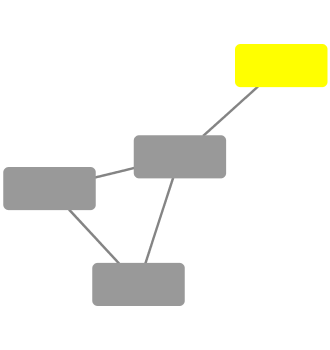
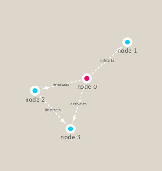

## Metagenomics co-occurence networks 

Here examine data from the Tarwa Ocean prokect on bacteria in ocean water samples from around the world
We will use the **igraph** package from CRAN and the **RCy3** package from bioconductor to build and visualize networks of this data 

```{r}
#Load the packages
library(RCy3)
library(igraph)
library(RColorBrewer)
```

# Test the connection to Cytoscape.
```{r}
#Test connection to Cytoscape.
cytoscapePing()

# Check the version
cytoscapeVersionInfo()
```

```{r}
g <- makeSimpleIgraph()
createNetworkFromIgraph(g,"myGraph")
```

```{r}
plot(g)
```

Insert the image into this Rmd report
```{r}
# including the Cytoscape rendered network image in our report
fig <- exportImage(filename="demo", type="png", height=350)

```

```{r}
#setting marquee style 
setVisualStyle("Marquee")
```


```{r}
fig <- exportImage(filename="demo_marquee", type="png", height=350)


```

```{r}
styles <- getVisualStyleNames()
styles
```

```{r}
plot(g)
```


## Read our metagenomics data set

```{r}
## scripts for processing located in "inst/data-raw/"
prok_vir_cor <- read.delim("./data/virus_prok_cor_abundant.tsv", stringsAsFactors = FALSE)

## Have a peak at the first 6 rows
head(prok_vir_cor)
```

```{r}
g <- graph.data.frame(prok_vir_cor, directed = FALSE)
class(g)
g
```

```{r}
plot(g)
plot(g, vertex.label=NA)
plot(g, vertex.size=3, vertex.label=NA)
```


